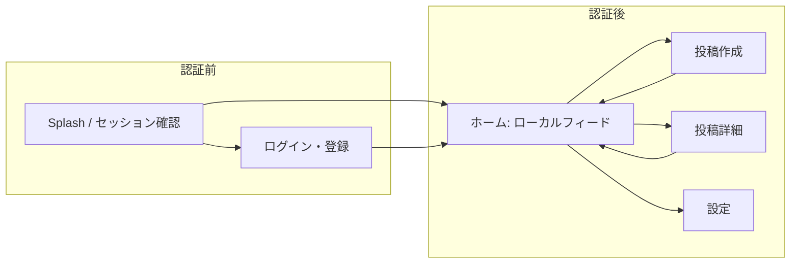

# ローカルSNS 詳細設計書（Flutter / Supabase）

| 項目 | 内容 |
|------|------|
| 文書名 | ローカルSNS 詳細設計書 |
| 対象 | Flutter クライアント（モバイル主想定）の画面・コンポーネント・状態・API 呼び出し境界 |
| 版数 | 1.0 |
| 作成日 | 2026-04-01 |
| 関連文書 | [要件定義書](./requirements-local-sns-flutter-supabase.md) / [全体設計書](./system-design-local-sns-flutter-supabase.md) |

---

## 改訂履歴

| 版 | 日付 | 変更内容 |
|----|------|----------|
| 1.0 | 2026-04-01 | 初版（UI は Apple Human Interface Guidelines を参考にユーザーファーストで記述） |

---

## 1. 本書の位置づけ

### 1.1 目的

要件定義書の機能・非機能要件と、全体設計書のレイヤ責務・型モデルを、**実装者がそのまま画面とユースケースに落とし込める粒度**まで分解する。特に **UI/UX** については、[Apple Human Interface Guidelines](https://developer.apple.com/design/human-interface-guidelines/)（以下 HIG）の考え方（**明瞭さ・従順性・奥行き**、ユーザーの**コントロール感**、**アクセシビリティ優先**）を参考にし、**ユーザーファースト**（目的達成の最短経路、失敗時の回復、プライバシーの可視化）を明示する。

### 1.2 本書で扱う / 扱わない

| 扱う | 扱わない（別文書・実装で補完） |
|------|--------------------------------|
| 画面一覧・遷移・状態遷移 | 完全 DDL・RLS SQL 全文 |
| ウィジェット構成・主要インタラクション | ピクセルパーフェクトなビジュアルデザイン（Figma 等） |
| 空/ロード/エラー UI の要件 | ブランド固有のイラスト・アセット仕様 |
| RPC パラメータ・戻り値の論理仕様 | サーバ実装の内部アルゴリズム詳細 |

### 1.3 プラットフォーム方針（Flutter と HIG の関係）

- **iOS**: 可能な範囲で HIG に親和する。**タップ領域の最小サイズ**（HIG 推奨のおおよそ **44×44 pt 相当**）、**セーフエリア**、**大きな文字**（Dynamic Type に相当する `textScaler`）、**Reduce Motion** を考慮する。
- **Android**: Material 3 と整合しつつ、**情報の階層・フィードバック・エラー回復**の原則は HIG と共通のユーザーファースト方針で統一する。
- **実装**: `ThemeData` / `CupertinoTheme` の併用や `platform` 分岐はプロジェクト方針で決定。本書は**振る舞い・情報設計**を主に規定する。

---

## 2. デザイン原則（ユーザーファースト + HIG 参考）

### 2.1 原則一覧

| 原則 | ユーザーへの意味 | アプリでの具体例 |
|------|------------------|------------------|
| **明瞭さ（Clarity）** | いま何が起きているか分かる | ロード中はスケルトンまたは明確なプログレス。距離は「約 2.1km」のように**推定であること**をラベルで示す。 |
| **従順性（Deference）** | コンテンツが主役 | フィードカードのタイポグラフィ・余白で本文を優先。装飾より読みやすさ。 |
| **奥行き（Depth）** | どこにいるか分かる | タブ／ナビゲーションで「フィード ↔ 投稿 ↔ 詳細」の階層を一貫して示す。 |
| **コントロール** | 誤操作・不安を減らす | 位置許可は**用途の説明の後**にシステムダイアログへ。投稿前に画像削除・本文編集が容易。 |
| **アクセシビリティ** | より多くの人が使える | 意味のある `Semantics`、十分なコントラスト、キーボード／スクリーンリーダー操作可能な主要フロー。 |
| **プライバシー** | 信頼できる | 「正確な位置は保存しません」「ぼかし後のみ送信」を**設定と初回フロー**で短く明示。 |

### 2.2 トークン（論理値・実装で `Theme` に集約）

以下は**初期案**。実装時は `AppTheme` 等に集約し、ダークモードでもコントラスト要件（WCAG 2.1 AA を目安）を満たす。

| トークン | 推奨の考え方 |
|----------|----------------|
| 角丸（カード） | 中程度（例: 12–16 logical px）。情報カードとして区切りが分かればよい。 |
| タップ領域 | 最低 **44×44** logical px（アイコンボタンは `minimumSize` / `TapRegion` で確保）。 |
| 本文行長 | 読みやすさ優先でカード内はおおよそ **45–75 文字相当**を目安に折り返し。 |
| 余白 | カード間・段落間に一貫したスペーシング（例: 8 の倍数）。 |
| モーション | `MediaQuery.disableAnimations` やユーザー設定を尊重。遷移は 300ms 前後を上限目安。 |

---

## 3. 情報アーキテクチャとナビゲーション

### 3.1 画面マップ（MVP 中心）

### 3.2 ナビゲーション方針

| パターン | 用途 |
|----------|------|
| **ルートスタック** | 投稿詳細はフィードから `push`。戻るでフィードに復帰。 |
| **モーダル / 全画面** | 投稿作成は `fullscreenDialog: true` 相当で「一時的なタスク完了」感を出す（HIG の modal sheet 思想に近い）。 |
| **タブ** | MVP は単一ホームでも可。将来「近く」「自分」分離時は bottom tab を検討。 |

---

## 4. 画面別詳細設計

### 4.1 スプラッシュ / セッション復元

| 項目 | 内容 |
|------|------|
| 目的 | `Supabase` セッション確認と、位置まわりの**キャッシュ状態**の読み込み。 |
| 表示 | ブランドマーク + 軽いインジケータ（長引く場合のみ）。 |
| 遷移 | セッションあり → ホーム（位置未許可ならホームで空状態）。セッションなし → ログイン。 |
| 失敗 | ネットワーク不可: **オフライン**メッセージと再試行（Pull-to-refresh またはボタン）。 |

### 4.2 認証（ログイン・登録）

| 項目 | 内容 |
|------|------|
| 要件対応 | FR-AUTH-01〜03 |
| コンポーネント | メールフォーム（`TextField`）、パスワード（マスキング）、送信、OAuth ボタン群。 |
| UX | エラーは**フィールド近傍**とスナックバーで重複しないよう整理。パスワード再設定導線をフッターに。 |
| アクセシビリティ | 各フィールドに `label`、エラーを `Semantics` で通知。 |

### 4.3 ホーム（ローカルフィード）

| 項目 | 内容 |
|------|------|
| 要件対応 | FR-FEED、FR-POST 表示、FR-LOC（クエリ位置） |
| レイアウト | `CustomScrollView` + `SliverAppBar`（タイトル「近くの投稿」等）+ 並び替え（MVP は新着のみ。人気順は後続）。 |
| カード要素 | ニックネーム（匿名寄り）、**相対時刻**（例: 2時間前）、**ぼかし基準の距離**（「約 ○○km」）、本文、任意サムネイル、リアクションサマリ。 |
| インタラクション | タップで詳細。Pull-to-refresh。無限スクロールは **カーソルページング**（全体設計の `FeedCursor`）。 |
| 空状態 | 件数 0: 「まだ近くに投稿がありません」+ 投稿への CTA。位置オフ: FR-LOC-04 に従い**明示メッセージ** + 設定導線。 |
| プライバシー | カードに微細な注記または情報アイコンで「距離はおおよその目安」等（文言は法務・プロダクトで確定）。 |

### 4.4 投稿作成

| 項目 | 内容 |
|------|------|
| 要件対応 | FR-POST、FR-LOC（ぼかし）、画像 Storage |
| フロー | 本文入力（必須）→ 任意で画像追加 → **位置取得 + ぼかし**成功後のみ送信可能。 |
| 位置 | 取得中はボタン無効 + 説明テキスト。失敗時は**再試行**と「位置が必要な理由」の短い説明。 |
| 送信後 | 成功: フィードへ戻り、**自分の投稿を先頭付近に反映**（楽観的 UI は任意。まずは確実なリフレッシュ）。 |
| バリデーション | 空投稿禁止、NGワードは FR-MOD-01（クライアント補助）。 |

### 4.5 投稿詳細

| 項目 | 内容 |
|------|------|
| 要件対応 | リアクション FR-REACT、コメント FR-COMMENT |
| レイアウト | ヘッダ（投稿者・時刻・距離）、本文、画像、`ReactionPicker`、コメントリスト、`CommentComposer`。 |
| リアクション | 👍 / 👀 / 🔥 を**セグメントまたはチップ**で選択。1 ユーザー 1 投稿 1 種（変更は即 UPSERT）。 |
| コメント | トップレベル一覧、各項目に「返信」（1 階層まで）。スレッドの視覚的インデント。 |
| 本人 | 自分の投稿のみ削除（メニュー）。NFR-SEC-02 整合。 |

### 4.6 設定

| 項目 | 内容 |
|------|------|
| 要件対応 | FR-LOC-04、プライバシー説明、任意 FR-STATUS |
| 項目例 | 位置情報の説明、OS 設定へのディープリンク、ログアウト、（任意）軽量ステータス。 |
| UX | トグルは**即時ではなく**、位置オフにした結果フィードが見られなくなる旨を**トグル下**に常時表示。 |

---

## 5. 状態設計（Presentation）

### 5.1 フィード画面の状態機械（論理）

| 状態 | 表示 | ユーザー操作 |
|------|------|----------------|
| `initial` | スケルトン | — |
| `loading` | スケルトンまたは中央インジケータ | — |
| `ready` | リスト | スクロール、タップ、pull |
| `empty` | 空状態イラスト/文言 + CTA | 投稿へ |
| `locationDenied` | 位置オフ説明 + 設定導線 | 設定 |
| `error` | エラー文言 + 再試行 | 再試行 |

### 5.2 投稿作成の状態

| 状態 | 挙動 |
|------|------|
| `editing` | 送信ボタンは位置未確定なら disabled。 |
| `obfuscating` | インジケータ、「位置を準備しています」。 |
| `submitting` | 二重送信防止。 |
| `success` / `failure` | スナックバーまたはダイアログで結果。 |

### 5.3 エラー文言の方針（全体設計の `Failure` マッピング）

| Failure | ユーザー向けメッセージの例 |
|---------|----------------------------|
| `NetworkFailure` | 接続できませんでした。通信環境を確認してください。 |
| `AuthFailure` | セッションの有効期限が切れました。再度ログインしてください。 |
| `ValidationFailure` | 具体的な修正内容（NG ワード、文字数等）。 |

---

## 6. コンポーネント一覧（再利用単位）

| コンポーネント | 責務 | 主な引数 |
|----------------|------|----------|
| `LocalPostCard` | フィード 1 件表示 | `FeedPost` VM、onTap |
| `DistanceLabel` | 「約 x km」 | `double? kilometers` |
| `ReactionPicker` | 3 種選択 | 現在値、onSelect |
| `CommentThread` | コメント + 1 階層返信表示 | `List<CommentVm>` |
| `LocationPermissionCallout` | 許可誘導 | onOpenSettings |
| `AsyncStateSwitcher` | ready/empty/error の切替 | 子ウィジェット群 |

---

## 7. ユースケースと画面の対応表

| 画面 | Application（全体設計の例） | 備考 |
|------|------------------------------|------|
| ホーム | `LoadLocalFeedUseCase` | クエリ用座標はサーバに永続化しない方針をコードレビューで確認 |
| 投稿 | `CreatePostUseCase`, `ObfuscateLocationUseCase` | 画像アップロード順序は全体設計シーケンスに準拠 |
| 詳細 | `SubmitReaction`, コメント用 UC | リアクションは UPSERT |
| 設定 | `ProfileRepository` / 位置サービス | — |

---

## 8. API / RPC 詳細（論理契約）

### 8.1 `get_local_feed`

| 項目 | 内容 |
|------|------|
| 目的 | FR-FEED-01〜03 をサーバ側で強制。 |
| 入力 | `lat`（double）, `lng`（double）, `limit`（int）, `cursor`（optional: `created_at` + `id` 等）, `sort`（`new` / `popular` ※ popular は MVP 外なら無視可） |
| 出力 | 投稿行の配列 + 集計（リアクション数）+ `next_cursor` |
| エラー | 認可失敗、パラメータ不正 → アプリは `AuthFailure` / `ValidationFailure` にマップ |

### 8.2 `create_post`（推奨時）

| 項目 | 内容 |
|------|------|
| 入力 | `content`, `image_url?`, `lat_blurred`, `lng_blurred`（**ぼかし後のみ**） |
| サーバ | `expires_at = now() + 24h` を強制 |
| 出力 | 作成された `Post` 行 |

### 8.3 テーブル直操作（全体設計と整合）

| 操作 | 方法 | 備考 |
|------|------|------|
| リアクション | `reactions` UPSERT | UNIQUE(user_id, post_id) |
| コメント | `comments` INSERT | `parent_comment_id` は NULL またはトップレベル ID のみ |

---

## 9. パフォーマンスと体感（NFR との接続）

| NFR | UI 側の対応 |
|-----|-------------|
| NFR-PERF-01 | 一覧は**ページング**、サムネイルはキャッシュ、`ListView.builder`。 |
| NFR-PERF-02 | 投稿後は楽観更新またはターゲットリフレッシュで**1 秒以内**に自分の投稿が見えるよう制御。 |
| NFR-PRIV-01 | UI に正確座標を表示しない。デバッグビルドのみログ制限。 |

---

## 10. アクセシビリティチェックリスト（リリース前）

- [ ] 主要ボタンが最小タップ領域を満たす  
- [ ] 動的フォント（`textScaler`）でレイアウト破綻がない（はみ出しはスクロールで回避）  
- [ ] 画像に意味がある場合は `Semantics` または空の `semanticLabel` 方針を統一  
- [ ] コントラスト比（本文・ボタン）をテーマで確認  
- [ ] VoiceOver / TalkBack でフィード 1 件の読み上げ順が自然（投稿者 → 時刻 → 距離 → 本文）  

---

## 11. MVP スコープとの対応

| MVP 必須（要件 9.1） | 本書のセクション |
|----------------------|------------------|
| 認証 | 4.2 |
| 投稿 + ぼかし + TTL | 4.4, 8.2 |
| 5km フィード新着 | 4.3, 8.1 |
| リアクション | 4.5, 6, 8.3 |

MVP 後（コメント等）は 4.5・8.3 を段階的に有効化。

---

## 12. 承認（任意）

| 役割 | 氏名 | 日付 |
|------|------|------|
| 作成 | | |
| レビュー | | |
