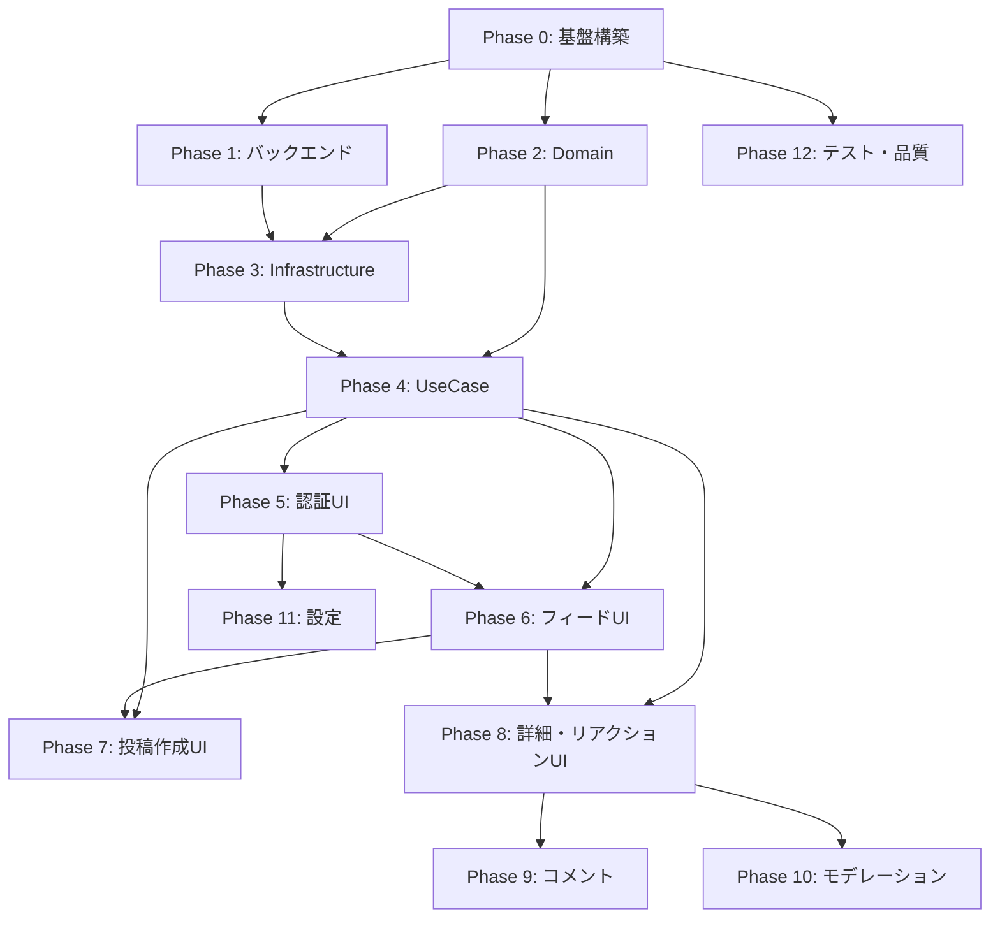

# ローカルSNS 実装計画書（Phase別タスク分解）

| 項目 | 内容 |
|------|------|
| 文書名 | ローカルSNS 実装計画書（Phase別タスク分解） |
| 対象 | Flutter クライアント + Supabase バックエンド |
| 版数 | 1.0 |
| 作成日 | 2026-04-01 |
| 関連文書 | [要件定義書](./requirements-local-sns-flutter-supabase.md) / [全体設計書](./system-design-local-sns-flutter-supabase.md) / [詳細設計書](./detailed-design-local-sns-flutter-supabase.md) |

---

## 全体フェーズ概要

| Phase | タイトル | 概要 | MVP |
|-------|---------|------|-----|
| 0 | プロジェクト基盤構築 | 依存関係・ディレクトリ構造・テーマ・DI | 必須 |
| 1 | Supabase バックエンド構築 | PostGIS・テーブル・RLS・RPC・Storage | 必須 |
| 2 | Domain レイヤ実装 | 値オブジェクト・エンティティ・Failure型・Repository抽象 | 必須 |
| 3 | Infrastructure レイヤ実装 | DTO・Mapper・Supabase具象Repository・位置サービス | 必須 |
| 4 | Application レイヤ実装（UseCase） | 認証・位置ぼかし・投稿・フィード・リアクション | 必須 |
| 5 | 認証 UI | スプラッシュ・ログイン・セッション復元 | 必須 |
| 6 | フィード UI | ローカルフィード一覧・カード・ページング・空状態 | 必須 |
| 7 | 投稿作成 UI | テキスト入力・画像選択・位置取得＋ぼかし・送信 | 必須 |
| 8 | 投稿詳細・リアクション UI | 詳細画面・リアクション選択・自分の投稿削除 | 必須 |
| 9 | コメント機能 | コメント一覧・作成・1階層返信 | MVP後 |
| 10 | モデレーション・通報・ブロック | NGワード・通報・ブロック | MVP後 |
| 11 | 設定画面・プロフィール | 設定・位置共有説明・ログアウト・ステータス | MVP後 |
| 12 | テスト・品質・アクセシビリティ | 全レイヤテスト・a11y・パフォーマンス最適化 | 必須 |

---

## Phase 0: プロジェクト基盤構築

### 0-1. 依存パッケージの追加（pubspec.yaml）

| タスクID | タスク | 詳細 | 対応要件 |
|----------|--------|------|----------|
| 0-1-1 | `supabase_flutter` 追加 | Supabase Auth / Database / Storage / Realtime の統合SDK | FR-AUTH, FR-POST, FR-FEED |
| 0-1-2 | `geolocator` 追加 | OS の位置情報権限取得・緯度経度取得 | FR-LOC-01〜04 |
| 0-1-3 | `image_picker` 追加 | カメラ/ギャラリーから画像選択 | FR-POST（画像任意） |
| 0-1-4 | `flutter_riverpod`（または `riverpod` + `hooks_riverpod`）追加 | 状態管理・DI | 全体設計2.1（Presentation） |
| 0-1-5 | `go_router` 追加 | 宣言的ルーティング | 詳細設計3.2 |
| 0-1-6 | `equatable` 追加 | 値オブジェクトの等値比較 | 全体設計4.1 |
| 0-1-7 | `intl` 追加 | 日時フォーマット（相対時刻表示） | 詳細設計4.3（カード要素） |
| 0-1-8 | `cached_network_image` 追加 | 画像キャッシュ | NFR-PERF-01 |
| 0-1-9 | `uuid` 追加 | クライアント側UUID生成（必要な場合） | — |
| 0-1-10 | `flutter_lints` / `very_good_analysis` 確認 | lint ルール設定 | 品質 |
| 0-1-11 | `mockito` / `mocktail` dev依存追加 | テスト用モック | 全体設計9 |

### 0-2. ディレクトリ構造の構築

| タスクID | タスク | 作成パス | 対応設計 |
|----------|--------|----------|----------|
| 0-2-1 | Domain レイヤ基盤 | `lib/domain/` | 全体設計2（Domain） |
| 0-2-2 | Domain - core | `lib/domain/core/` | Failure, Result型 |
| 0-2-3 | Domain - entities | `lib/domain/entities/` | Post, Profile, Reaction, Comment |
| 0-2-4 | Domain - value_objects | `lib/domain/value_objects/` | UserId, PostId, GeoCoordinate 等 |
| 0-2-5 | Domain - repositories | `lib/domain/repositories/` | 抽象Repository interface |
| 0-2-6 | Domain - services | `lib/domain/services/` | ぼかしロジック等 |
| 0-2-7 | Application レイヤ基盤 | `lib/application/` | 全体設計2（Application） |
| 0-2-8 | Application - auth | `lib/application/auth/` | 認証UseCase |
| 0-2-9 | Application - posts | `lib/application/posts/` | 投稿UseCase |
| 0-2-10 | Application - feed | `lib/application/feed/` | フィードUseCase |
| 0-2-11 | Application - reactions | `lib/application/reactions/` | リアクションUseCase |
| 0-2-12 | Application - location | `lib/application/location/` | 位置ぼかしUseCase |
| 0-2-13 | Application - comments | `lib/application/comments/` | コメントUseCase（MVP後） |
| 0-2-14 | Infrastructure レイヤ基盤 | `lib/infrastructure/` | 全体設計2（Infrastructure） |
| 0-2-15 | Infrastructure - supabase | `lib/infrastructure/supabase/` | Supabase具象実装 |
| 0-2-16 | Infrastructure - dto | `lib/infrastructure/dto/` | PostDto, RpcFeedItemDto等 |
| 0-2-17 | Infrastructure - mappers | `lib/infrastructure/mappers/` | DTO↔Entity変換 |
| 0-2-18 | Infrastructure - location | `lib/infrastructure/location/` | geolocator具象実装 |
| 0-2-19 | Presentation レイヤ基盤 | `lib/presentation/` | 全体設計2（Presentation） |
| 0-2-20 | Presentation - auth | `lib/presentation/auth/` | 認証画面 |
| 0-2-21 | Presentation - feed | `lib/presentation/feed/` | フィード画面 |
| 0-2-22 | Presentation - compose | `lib/presentation/compose/` | 投稿作成画面 |
| 0-2-23 | Presentation - detail | `lib/presentation/detail/` | 投稿詳細画面 |
| 0-2-24 | Presentation - settings | `lib/presentation/settings/` | 設定画面 |
| 0-2-25 | Presentation - shared | `lib/presentation/shared/` | 共通Widget |
| 0-2-26 | Presentation - theme | `lib/presentation/theme/` | テーマ定義 |
| 0-2-27 | Presentation - router | `lib/presentation/router/` | ルーティング定義 |

### 0-3. テーマ・デザイントークン設定

| タスクID | タスク | 詳細 | 対応設計 |
|----------|--------|------|----------|
| 0-3-1 | `AppTheme` クラス作成 | Material 3 ベース、`ColorScheme.fromSeed` | 詳細設計2.2 |
| 0-3-2 | ダークモード対応 | `ThemeData` light/dark 定義 | 詳細設計2.2（WCAG AA） |
| 0-3-3 | デザイントークン定数定義 | 角丸（12-16px）、タップ領域（44x44）、余白（8の倍数）、モーション（300ms上限） | 詳細設計2.2 |
| 0-3-4 | テキストスタイル定義 | 本文行長45-75文字目安、`textScaler`対応 | 詳細設計2.2 |

### 0-4. Supabase 初期化

| タスクID | タスク | 詳細 | 対応要件 |
|----------|--------|------|----------|
| 0-4-1 | `main.dart` に Supabase.initialize 追加 | URL, anonKey の設定（環境変数 or 定数ファイル） | — |
| 0-4-2 | 環境設定ファイル作成 | `.env` または `lib/config/` にSupabase接続情報を分離 | セキュリティ |
| 0-4-3 | `ProviderScope` でアプリをラップ | Riverpod の初期化 | — |

### 0-5. ルーティング設定

| タスクID | タスク | 詳細 | 対応設計 |
|----------|--------|------|----------|
| 0-5-1 | `AppRouter` 定義 | GoRouter でルート定義（splash, login, feed, compose, detail, settings） | 詳細設計3.1 |
| 0-5-2 | 認証ガード（リダイレクト） | セッション有無でログイン/フィードへ振り分け | 詳細設計3.1 |
| 0-5-3 | 投稿作成をモーダル遷移に設定 | `fullscreenDialog: true` 相当 | 詳細設計3.2 |

---

## Phase 1: Supabase バックエンド構築

### 1-1. PostgreSQL 拡張有効化

| タスクID | タスク | SQL/操作 | 対応要件 |
|----------|--------|----------|----------|
| 1-1-1 | PostGIS 拡張有効化 | `CREATE EXTENSION IF NOT EXISTS postgis;` | NFR-SCALE-01, FR-FEED-01 |
| 1-1-2 | uuid-ossp 拡張確認 | `CREATE EXTENSION IF NOT EXISTS "uuid-ossp";` | PK生成 |

### 1-2. テーブル作成

| タスクID | タスク | テーブル | 対応要件 |
|----------|--------|----------|----------|
| 1-2-1 | `profiles` テーブル作成 | `id (uuid PK = auth.users.id)`, `name (text)`, `avatar_url (text?)`, `created_at (timestamptz)` | FR-AUTH-02, 要件6.1 |
| 1-2-2 | `profiles` トリガ作成 | `auth.users` INSERT 時に `profiles` 自動作成（`handle_new_user` 関数） | 全体設計6.1 |
| 1-2-3 | `posts` テーブル作成 | `id`, `user_id`, `content`, `image_url`, `location (geography(Point,4326))`, `created_at`, `expires_at` | 要件6.1, FR-POST |
| 1-2-4 | `posts` GiST インデックス作成 | `CREATE INDEX idx_posts_location ON posts USING GIST (location);` | NFR-SCALE-02 |
| 1-2-5 | `posts` expires_at インデックス | `CREATE INDEX idx_posts_expires_at ON posts (expires_at);` | NFR-PERF-01 |
| 1-2-6 | `posts` created_at インデックス | `CREATE INDEX idx_posts_created_at ON posts (created_at DESC);` | FR-FEED-02 |
| 1-2-7 | `reactions` テーブル作成 | `id`, `user_id`, `post_id`, `type (text)`, `created_at` + `UNIQUE(user_id, post_id)` | FR-REACT-01〜02, 要件6.1 |
| 1-2-8 | `comments` テーブル作成 | `id`, `user_id`, `post_id`, `parent_comment_id`, `content`, `created_at` | FR-COMMENT-01〜02, 要件6.1 |
| 1-2-9 | `reports` テーブル作成（MVP後） | `id`, `reporter_id`, `target_type`, `target_id`, `reason`, `status`, `created_at` | FR-MOD-02 |
| 1-2-10 | `blocks` テーブル作成（MVP後） | `id`, `blocker_id`, `blocked_id`, `created_at` | FR-MOD-03 |

### 1-3. RLS ポリシー設定

| タスクID | タスク | テーブル | ポリシー内容 | 対応要件 |
|----------|--------|----------|-------------|----------|
| 1-3-1 | `profiles` RLS 有効化 | profiles | 全行 SELECT 可（認証済み）、自分の行のみ UPDATE | NFR-SEC-01 |
| 1-3-2 | `posts` RLS 有効化 | posts | 認証済みユーザー SELECT 可（地理条件はRPC側で制御）、INSERT は `user_id = auth.uid()` | NFR-SEC-01, NFR-SEC-02 |
| 1-3-3 | `posts` DELETE ポリシー | posts | `user_id = auth.uid()` の場合のみ | NFR-SEC-02 |
| 1-3-4 | `reactions` RLS 有効化 | reactions | 認証済み SELECT、INSERT/UPDATE/DELETE は `user_id = auth.uid()` | NFR-SEC-01 |
| 1-3-5 | `comments` RLS 有効化 | comments | 認証済み SELECT、INSERT は `user_id = auth.uid()` | NFR-SEC-01 |

### 1-4. RPC 関数作成

| タスクID | タスク | 関数名 | 対応要件 |
|----------|--------|--------|----------|
| 1-4-1 | `get_local_feed` RPC 作成 | `get_local_feed(lat, lng, limit, cursor_created_at, cursor_id, sort)` | FR-FEED-01〜03, 詳細設計8.1 |
| 1-4-2 | `get_local_feed` 内で `ST_DWithin(..., 5000)` + `expires_at > now()` を強制 | — | FR-FEED-01, FR-POST-01 |
| 1-4-3 | `get_local_feed` にリアクション数集計を含める | `LEFT JOIN reactions` + `COUNT` or サブクエリ | FR-FEED-03（人気順用） |
| 1-4-4 | `get_local_feed` にカーソルページング実装 | `(created_at, id)` ベースの keyset pagination | NFR-PERF-01 |
| 1-4-5 | `create_post` RPC 作成（推奨） | `create_post(content, image_url, lat_blurred, lng_blurred)` → `expires_at = now() + interval '24 hours'` をサーバ強制 | 詳細設計8.2, FR-POST-01 |
| 1-4-6 | `get_post_detail` RPC 作成 | 単一投稿 + リアクション集計 + コメント数 | 詳細設計4.5 |

### 1-5. Storage 設定

| タスクID | タスク | 詳細 | 対応要件 |
|----------|--------|------|----------|
| 1-5-1 | `post-images` バケット作成 | public or private（signedUrl）を選択 | FR-POST-03 |
| 1-5-2 | Storage ポリシー設定 | アップロード: 認証済み、削除: 本人のみ | NFR-SEC-03 |
| 1-5-3 | ファイルサイズ制限設定 | 例: 5MB 上限 | パフォーマンス |

### 1-6. Supabase Auth 設定

| タスクID | タスク | 詳細 | 対応要件 |
|----------|--------|------|----------|
| 1-6-1 | メール認証有効化 | Supabase Dashboard で Email provider ON | FR-AUTH-01 |
| 1-6-2 | OAuth プロバイダ設定（任意） | Google / Apple 等の設定 | FR-AUTH-01 |
| 1-6-3 | メール確認フロー設定 | 確認メールテンプレート・リダイレクトURL | FR-AUTH-01 |

> **手順の正本（ダッシュボード操作）**: [`docs/supabase-auth-dashboard.md`](./supabase-auth-dashboard.md)

---

## Phase 2: Domain レイヤ実装

### 2-1. Core（基盤型）

| タスクID | タスク | ファイル | 詳細 | 対応設計 |
|----------|--------|----------|------|----------|
| 2-1-1 | `Failure` sealed class 定義 | `lib/domain/core/failure.dart` | `NetworkFailure`, `AuthFailure`, `ValidationFailure`, `ServerFailure`, `LocationFailure` | 全体設計4.4 |
| 2-1-2 | `Result` 型定義（またはパッケージ利用） | `lib/domain/core/result.dart` | `sealed class Result<T, E>` with `Success` / `Failure` | 全体設計4.4 |
| 2-1-3 | `FeedSort` enum 定義 | `lib/domain/core/feed_sort.dart` | `newest`, `popular` | FR-FEED-02〜03 |
| 2-1-4 | `FeedCursor` 値型定義 | `lib/domain/core/feed_cursor.dart` | `createdAt`, `id` でカーソル表現 | 詳細設計8.1 |

### 2-2. 値オブジェクト（Value Objects）

| タスクID | タスク | ファイル | 不変条件 | 対応設計 |
|----------|--------|----------|----------|----------|
| 2-2-1 | `UserId` | `lib/domain/value_objects/user_id.dart` | 非空UUID文字列 | 全体設計4.2 |
| 2-2-2 | `PostId` | `lib/domain/value_objects/post_id.dart` | 非空UUID文字列 | 全体設計4.2 |
| 2-2-3 | `CommentId` | `lib/domain/value_objects/comment_id.dart` | 非空UUID文字列 | 全体設計4.2 |
| 2-2-4 | `GeoCoordinate` | `lib/domain/value_objects/geo_coordinate.dart` | lat [-90,90], lng [-180,180] | 全体設計4.2 |
| 2-2-5 | `ObfuscatedLocation` | `lib/domain/value_objects/obfuscated_location.dart` | `GeoCoordinate` ラップ、「永続化可」ブランド型 | 全体設計4.2 |
| 2-2-6 | `ReactionType` enum | `lib/domain/value_objects/reaction_type.dart` | `like`, `look`, `fire` の3値 | 全体設計4.2, FR-REACT-01 |
| 2-2-7 | `FeedRadiusMeters` const | `lib/domain/value_objects/feed_radius.dart` | 5000（固定値） | 全体設計4.2 |
| 2-2-8 | `PostTtl` const | `lib/domain/value_objects/post_ttl.dart` | `Duration(hours: 24)` | 全体設計4.2 |

### 2-3. エンティティ（Entities）

| タスクID | タスク | ファイル | 主なフィールド | 対応設計 |
|----------|--------|----------|---------------|----------|
| 2-3-1 | `Profile` エンティティ | `lib/domain/entities/profile.dart` | `UserId id`, `String? displayName`, `String? avatarUrl`, `DateTime createdAt` | 全体設計4.3 |
| 2-3-2 | `Post` エンティティ | `lib/domain/entities/post.dart` | `PostId id`, `UserId authorId`, `String content`, `Uri? imageUrl`, `ObfuscatedLocation location`, `DateTime createdAt`, `DateTime expiresAt` + `bool get isExpired` | 全体設計4.3 |
| 2-3-3 | `FeedPost` 読み取りモデル | `lib/domain/entities/feed_post.dart` | `Post` の全フィールド + `int reactionCount`, `String? authorName`, `double? distanceKm` | 全体設計4.3 |
| 2-3-4 | `Reaction` エンティティ | `lib/domain/entities/reaction.dart` | `UserId userId`, `PostId postId`, `ReactionType type`, `DateTime createdAt` | 全体設計4.3 |
| 2-3-5 | `Comment` エンティティ | `lib/domain/entities/comment.dart` | `CommentId id`, `PostId postId`, `UserId authorId`, `CommentId? parentId`, `String content`, `DateTime createdAt` | 全体設計4.3 |

### 2-4. Repository 抽象（Interface）

| タスクID | タスク | ファイル | 主なメソッド | 対応設計 |
|----------|--------|----------|-------------|----------|
| 2-4-1 | `AuthRepository` | `lib/domain/repositories/auth_repository.dart` | `watchSession()`, `signInWithEmail()`, `signInWithOAuth()`, `signOut()`, `getCurrentUserId()` | 全体設計5.1 |
| 2-4-2 | `LocationRepository` | `lib/domain/repositories/location_repository.dart` | `requestPermission()`, `getCurrentPosition()` → `GeoCoordinate` | 全体設計5.1 |
| 2-4-3 | `PostRepository` | `lib/domain/repositories/post_repository.dart` | `createPost(...)`, `deletePost(PostId)` | 全体設計5.1 |
| 2-4-4 | `FeedRepository` | `lib/domain/repositories/feed_repository.dart` | `fetchFeed(viewerQueryPoint, cursor, sort)` → `Result<List<FeedPost>>` | 全体設計5.1 |
| 2-4-5 | `ReactionRepository` | `lib/domain/repositories/reaction_repository.dart` | `upsertReaction(PostId, ReactionType)`, `removeReaction(PostId)`, `getMyReaction(PostId)` | 全体設計5.1 |
| 2-4-6 | `CommentRepository` | `lib/domain/repositories/comment_repository.dart` | `listByPost(PostId)`, `addComment(...)`, `addReply(...)` | 全体設計5.1 |
| 2-4-7 | `ProfileRepository` | `lib/domain/repositories/profile_repository.dart` | `getCurrentProfile()`, `updateProfile(...)` | 全体設計5.1 |
| 2-4-8 | `StorageRepository` | `lib/domain/repositories/storage_repository.dart` | `uploadPostImage(Uint8List, String contentType)` → `Result<Uri>` | 全体設計5.1 |

### 2-5. Domain サービス

| タスクID | タスク | ファイル | 詳細 | 対応設計 |
|----------|--------|----------|------|----------|
| 2-5-1 | `LocationObfuscationService` | `lib/domain/services/location_obfuscation_service.dart` | 生 `GeoCoordinate` → `ObfuscatedLocation`。±300m〜1km のランダムオフセット。方位角・距離をランダム化して目的地座標算出（WGS84メートル換算） | FR-LOC-03, 全体設計5.2 |

---

## Phase 3: Infrastructure レイヤ実装

### 3-1. DTO（Data Transfer Objects）

| タスクID | タスク | ファイル | 詳細 | 対応設計 |
|----------|--------|----------|------|----------|
| 3-1-1 | `ProfileDto` | `lib/infrastructure/dto/profile_dto.dart` | `fromJson` / `toJson`、snake_case ↔ camelCase | 全体設計4.5 |
| 3-1-2 | `PostDto` | `lib/infrastructure/dto/post_dto.dart` | posts テーブル行の JSON 表現 | 全体設計4.5 |
| 3-1-3 | `RpcFeedItemDto` | `lib/infrastructure/dto/rpc_feed_item_dto.dart` | `get_local_feed` RPC 戻り値の1行。投稿 + `reaction_count` + `author_name` | 全体設計4.5 |
| 3-1-4 | `ReactionDto` | `lib/infrastructure/dto/reaction_dto.dart` | reactions テーブル行 | 全体設計4.5 |
| 3-1-5 | `CommentDto` | `lib/infrastructure/dto/comment_dto.dart` | comments テーブル行 | 全体設計4.5 |
| 3-1-6 | `RpcFeedParams` | `lib/infrastructure/dto/rpc_feed_params.dart` | RPC パラメータ型（lat, lng, limit, cursor 等） | 全体設計4.5 |

### 3-2. Mapper

| タスクID | タスク | ファイル | 変換内容 | 対応設計 |
|----------|--------|----------|----------|----------|
| 3-2-1 | `ProfileMapper` | `lib/infrastructure/mappers/profile_mapper.dart` | `ProfileDto` → `Profile` | 全体設計7.2 |
| 3-2-2 | `PostMapper` | `lib/infrastructure/mappers/post_mapper.dart` | `PostDto` → `Post`, `RpcFeedItemDto` → `FeedPost` | 全体設計7.2 |
| 3-2-3 | `ReactionMapper` | `lib/infrastructure/mappers/reaction_mapper.dart` | `ReactionDto` → `Reaction` | 全体設計7.2 |
| 3-2-4 | `CommentMapper` | `lib/infrastructure/mappers/comment_mapper.dart` | `CommentDto` → `Comment` | 全体設計7.2 |

### 3-3. Supabase Repository 具象実装

| タスクID | タスク | ファイル | 詳細 | 対応設計 |
|----------|--------|----------|------|----------|
| 3-3-1 | `SupabaseAuthRepository` | `lib/infrastructure/supabase/supabase_auth_repository.dart` | `signInWithPassword`, OAuth, `signOut`, `onAuthStateChange` Stream | 全体設計6.1 |
| 3-3-2 | `SupabaseProfileRepository` | `lib/infrastructure/supabase/supabase_profile_repository.dart` | `from('profiles').select()`, `upsert()` | 全体設計6.1 |
| 3-3-3 | `SupabasePostRepository` | `lib/infrastructure/supabase/supabase_post_repository.dart` | `rpc('create_post', ...)` または `from('posts').insert()`, `delete()` | 全体設計6.1 |
| 3-3-4 | `SupabaseFeedRepository` | `lib/infrastructure/supabase/supabase_feed_repository.dart` | `rpc('get_local_feed', ...)` → `List<FeedPost>` | 全体設計6.1 |
| 3-3-5 | `SupabaseReactionRepository` | `lib/infrastructure/supabase/supabase_reaction_repository.dart` | `from('reactions').upsert()`, `delete()` | 全体設計6.1 |
| 3-3-6 | `SupabaseCommentRepository` | `lib/infrastructure/supabase/supabase_comment_repository.dart` | `from('comments').select()`, `insert()` | 全体設計6.1 |
| 3-3-7 | `SupabaseStorageRepository` | `lib/infrastructure/supabase/supabase_storage_repository.dart` | `storage.from('post-images').uploadBinary()`, `getPublicUrl()` | 全体設計6.1 |

### 3-4. 位置サービス具象実装

| タスクID | タスク | ファイル | 詳細 | 対応設計 |
|----------|--------|----------|------|----------|
| 3-4-1 | `GeolocatorLocationRepository` | `lib/infrastructure/location/geolocator_location_repository.dart` | `geolocator` を使った権限取得・位置取得。`LocationRepository` の具象実装 | FR-LOC-01〜02 |
| 3-4-2 | `LocationPermissionState` 定義 | `lib/domain/value_objects/location_permission_state.dart` | `granted`, `denied`, `deniedForever`, `serviceDisabled` | FR-LOC-04 |

### 3-5. DI（依存性注入）設定

| タスクID | タスク | ファイル | 詳細 | 対応設計 |
|----------|--------|----------|------|----------|
| 3-5-1 | Repository Provider 定義 | `lib/infrastructure/providers.dart` | Riverpod の Provider で各 Repository の具象 → 抽象のバインド | 全体設計2.1 |
| 3-5-2 | UseCase Provider 定義 | `lib/application/providers.dart` | 各 UseCase の Provider 定義 | 全体設計2.1 |

---

## Phase 4: Application レイヤ実装（UseCase）

### 4-1. 認証 UseCase

| タスクID | タスク | ファイル | 詳細 | 対応要件 |
|----------|--------|----------|------|----------|
| 4-1-1 | `SignInWithEmailUseCase` | `lib/application/auth/sign_in_with_email_use_case.dart` | メール + パスワードで Supabase Auth ログイン | FR-AUTH-01 |
| 4-1-2 | `SignUpWithEmailUseCase` | `lib/application/auth/sign_up_with_email_use_case.dart` | 新規登録（メール確認付き） | FR-AUTH-01 |
| 4-1-3 | `SignInWithOAuthUseCase` | `lib/application/auth/sign_in_with_oauth_use_case.dart` | OAuth プロバイダログイン | FR-AUTH-01 |
| 4-1-4 | `SignOutUseCase` | `lib/application/auth/sign_out_use_case.dart` | ログアウト | FR-AUTH-01 |
| 4-1-5 | `WatchSessionUseCase` | `lib/application/auth/watch_session_use_case.dart` | セッション状態 Stream 監視 | 詳細設計4.1 |

### 4-2. 位置・ぼかし UseCase

| タスクID | タスク | ファイル | 詳細 | 対応要件 |
|----------|--------|----------|------|----------|
| 4-2-1 | `RequestLocationPermissionUseCase` | `lib/application/location/request_location_permission_use_case.dart` | OS 位置権限のリクエストと状態返却 | FR-LOC-01 |
| 4-2-2 | `GetCurrentPositionUseCase` | `lib/application/location/get_current_position_use_case.dart` | 端末の現在位置（生座標）を取得 | FR-LOC-02 |
| 4-2-3 | `ObfuscateLocationUseCase` | `lib/application/location/obfuscate_location_use_case.dart` | 生 `GeoCoordinate` → `ObfuscatedLocation`。`LocationObfuscationService` を呼び出す | FR-LOC-03 |

### 4-3. 投稿 UseCase

| タスクID | タスク | ファイル | 詳細 | 対応要件 |
|----------|--------|----------|------|----------|
| 4-3-1 | `CreatePostUseCase` | `lib/application/posts/create_post_use_case.dart` | ①画像あれば Storage アップロード → URI取得 ②位置ぼかし ③`PostRepository.createPost()` 呼び出し。シーケンス: 全体設計8.1 | FR-POST-01〜03 |
| 4-3-2 | `DeletePostUseCase` | `lib/application/posts/delete_post_use_case.dart` | 自分の投稿削除 | NFR-SEC-02 |

### 4-4. フィード UseCase

| タスクID | タスク | ファイル | 詳細 | 対応要件 |
|----------|--------|----------|------|----------|
| 4-4-1 | `LoadLocalFeedUseCase` | `lib/application/feed/load_local_feed_use_case.dart` | ①位置取得（生座標、クエリ用のみ） ②`FeedRepository.fetchFeed()` 呼び出し。シーケンス: 全体設計8.2 | FR-FEED-01〜03 |
| 4-4-2 | `LoadMoreFeedUseCase`（or メソッド統合） | — | カーソルを渡して次ページ取得 | NFR-PERF-01 |

### 4-5. リアクション UseCase

| タスクID | タスク | ファイル | 詳細 | 対応要件 |
|----------|--------|----------|------|----------|
| 4-5-1 | `SubmitReactionUseCase` | `lib/application/reactions/submit_reaction_use_case.dart` | リアクション UPSERT | FR-REACT-01〜02 |
| 4-5-2 | `RemoveReactionUseCase` | `lib/application/reactions/remove_reaction_use_case.dart` | リアクション削除 | FR-REACT-02 |

### 4-6. コメント UseCase（MVP後）

| タスクID | タスク | ファイル | 詳細 | 対応要件 |
|----------|--------|----------|------|----------|
| 4-6-1 | `LoadCommentsUseCase` | `lib/application/comments/load_comments_use_case.dart` | 投稿に紐づくコメント一覧取得 | FR-COMMENT-01 |
| 4-6-2 | `AddCommentUseCase` | `lib/application/comments/add_comment_use_case.dart` | トップレベルコメント追加 | FR-COMMENT-01 |
| 4-6-3 | `AddReplyUseCase` | `lib/application/comments/add_reply_use_case.dart` | 1階層返信追加（`parent_comment_id` 検証） | FR-COMMENT-02 |

---

## Phase 5: 認証 UI

### 5-1. スプラッシュ画面

| タスクID | タスク | ファイル | 詳細 | 対応設計 |
|----------|--------|----------|------|----------|
| 5-1-1 | `SplashPage` Widget 作成 | `lib/presentation/auth/splash_page.dart` | ブランドマーク + インジケータ表示 | 詳細設計4.1 |
| 5-1-2 | セッション確認ロジック | — | `WatchSessionUseCase` でセッション有無判定 → ルーティング | 詳細設計4.1 |
| 5-1-3 | ネットワークエラー時の再試行UI | — | エラーメッセージ + 再試行ボタン | 詳細設計4.1 |

### 5-2. ログイン・登録画面

| タスクID | タスク | ファイル | 詳細 | 対応設計 |
|----------|--------|----------|------|----------|
| 5-2-1 | `LoginPage` Widget 作成 | `lib/presentation/auth/login_page.dart` | メールフォーム、パスワード、送信ボタン | 詳細設計4.2 |
| 5-2-2 | `SignUpPage` Widget 作成（またはタブ切替） | `lib/presentation/auth/sign_up_page.dart` | 新規登録フォーム + ニックネーム入力 | 詳細設計4.2, FR-AUTH-02 |
| 5-2-3 | OAuth ボタン配置 | — | Google / Apple サインインボタン | FR-AUTH-01 |
| 5-2-4 | バリデーション実装 | — | メール形式・パスワード長チェック、エラー表示はフィールド近傍 | 詳細設計4.2 |
| 5-2-5 | `AuthNotifier` / `AuthState` 作成 | `lib/presentation/auth/auth_notifier.dart` | ログイン/登録の状態管理（loading, success, error） | 詳細設計5 |
| 5-2-6 | パスワード再設定導線 | — | フッターにリンク配置 | 詳細設計4.2 |
| 5-2-7 | アクセシビリティ対応 | — | 各フィールドに `label`、エラーを `Semantics` で通知 | 詳細設計4.2 |

---

## Phase 6: フィード UI

### 6-1. フィード画面本体

| タスクID | タスク | ファイル | 詳細 | 対応設計 |
|----------|--------|----------|------|----------|
| 6-1-1 | `FeedPage` Widget 作成 | `lib/presentation/feed/feed_page.dart` | `CustomScrollView` + `SliverAppBar`（タイトル「近くの投稿」） | 詳細設計4.3 |
| 6-1-2 | `FeedNotifier` / `FeedState` 作成 | `lib/presentation/feed/feed_notifier.dart` | 状態: `initial`, `loading`, `ready`, `empty`, `locationDenied`, `error` | 詳細設計5.1 |
| 6-1-3 | Pull-to-refresh 実装 | — | `RefreshIndicator` でフィード再取得 | 詳細設計4.3 |
| 6-1-4 | 無限スクロール（ページング） | — | `ScrollController` で末尾検知 → `LoadMoreFeed` | 詳細設計4.3, NFR-PERF-01 |
| 6-1-5 | 投稿作成 FAB | — | フィードから投稿作成画面へ遷移するFAB | 詳細設計4.3 |

### 6-2. フィードカード

| タスクID | タスク | ファイル | 詳細 | 対応設計 |
|----------|--------|----------|------|----------|
| 6-2-1 | `LocalPostCard` Widget 作成 | `lib/presentation/shared/local_post_card.dart` | ニックネーム、相対時刻、距離（「約 ○○km」）、本文、サムネイル、リアクションサマリ | 詳細設計6 |
| 6-2-2 | `DistanceLabel` Widget 作成 | `lib/presentation/shared/distance_label.dart` | 「約 x km」表示、null 時は非表示 | 詳細設計6 |
| 6-2-3 | 相対時刻表示ヘルパー | `lib/presentation/shared/relative_time.dart` | 「○分前」「○時間前」等のフォーマット | 詳細設計4.3 |
| 6-2-4 | サムネイル画像表示 | — | `CachedNetworkImage` で画像キャッシュ | NFR-PERF-01 |
| 6-2-5 | リアクションサマリ表示 | — | カードにリアクション数をアイコン+数字で表示 | FR-REACT |

### 6-3. 空・エラー・位置拒否状態

| タスクID | タスク | ファイル | 詳細 | 対応設計 |
|----------|--------|----------|------|----------|
| 6-3-1 | `AsyncStateSwitcher` 共通Widget | `lib/presentation/shared/async_state_switcher.dart` | ready/empty/error の切替Widget | 詳細設計6 |
| 6-3-2 | 空状態UI | — | 「まだ近くに投稿がありません」+ 投稿CTA | 詳細設計4.3 |
| 6-3-3 | `LocationPermissionCallout` Widget | `lib/presentation/shared/location_permission_callout.dart` | 位置オフ時の説明 + OS設定ディープリンク | 詳細設計6, FR-LOC-04 |
| 6-3-4 | エラー状態UI | — | エラー文言 + 再試行ボタン | 詳細設計5.1 |
| 6-3-5 | スケルトンローディング | — | 初回ロード時のスケルトンカード表示 | 詳細設計5.1 |

---

## Phase 7: 投稿作成 UI

### 7-1. 投稿作成画面

| タスクID | タスク | ファイル | 詳細 | 対応設計 |
|----------|--------|----------|------|----------|
| 7-1-1 | `ComposePage` Widget 作成 | `lib/presentation/compose/compose_page.dart` | モーダル（fullscreenDialog）。テキスト入力 + 画像追加ボタン + 送信ボタン | 詳細設計4.4 |
| 7-1-2 | `ComposeNotifier` / `ComposeState` 作成 | `lib/presentation/compose/compose_notifier.dart` | 状態: `editing`, `obfuscating`, `submitting`, `success`, `failure` | 詳細設計5.2 |
| 7-1-3 | テキスト入力フィールド | — | `TextField` with maxLength。空投稿禁止バリデーション | FR-POST（content必須） |
| 7-1-4 | 画像選択・プレビュー | — | `image_picker` でカメラ/ギャラリー選択。選択後プレビュー表示 + 削除ボタン | FR-POST（image任意） |
| 7-1-5 | 位置取得 + ぼかしフロー | — | 画面表示時に位置取得開始 → ぼかし → 成功後のみ送信ボタン有効化。取得中: 「位置を準備しています」 | 詳細設計4.4, FR-LOC |
| 7-1-6 | 位置取得失敗時の再試行UI | — | 失敗メッセージ + 「位置が必要な理由」説明 + 再試行ボタン | 詳細設計4.4 |
| 7-1-7 | 送信処理 | — | `CreatePostUseCase` 呼び出し。二重送信防止（ボタン無効化） | 詳細設計5.2 |
| 7-1-8 | 送信成功時のフィードバック | — | フィードへ戻り、リフレッシュで自分の投稿が先頭付近に表示 | 詳細設計4.4, NFR-PERF-02 |
| 7-1-9 | NGワードクライアント補助（MVP後可） | — | `FR-MOD-01` のクライアント側チェック | FR-MOD-01 |

---

## Phase 8: 投稿詳細・リアクション UI

### 8-1. 投稿詳細画面

| タスクID | タスク | ファイル | 詳細 | 対応設計 |
|----------|--------|----------|------|----------|
| 8-1-1 | `PostDetailPage` Widget 作成 | `lib/presentation/detail/post_detail_page.dart` | ヘッダ（投稿者・時刻・距離）+ 本文 + 画像 + リアクション + コメント（MVP後） | 詳細設計4.5 |
| 8-1-2 | `PostDetailNotifier` / `PostDetailState` 作成 | `lib/presentation/detail/post_detail_notifier.dart` | 投稿詳細の読み込み・リアクション・コメントの状態管理 | — |
| 8-1-3 | 画像フル表示 | — | サムネイルタップで拡大表示（オプション） | — |
| 8-1-4 | 自分の投稿の削除メニュー | — | PopupMenuButton or Slidable で削除。確認ダイアログ | NFR-SEC-02, 詳細設計4.5 |

### 8-2. リアクション

| タスクID | タスク | ファイル | 詳細 | 対応設計 |
|----------|--------|----------|------|----------|
| 8-2-1 | `ReactionPicker` Widget 作成 | `lib/presentation/shared/reaction_picker.dart` | 👍 / 👀 / 🔥 のセグメント or チップ。選択中を視覚的にハイライト | 詳細設計6, FR-REACT-01 |
| 8-2-2 | リアクション UPSERT 処理 | — | タップで `SubmitReactionUseCase` 呼び出し。既に同じリアクションなら `RemoveReaction` | FR-REACT-02 |
| 8-2-3 | リアクション数表示更新 | — | 操作後に即時UI更新（楽観的 or リフレッシュ） | NFR-PERF-02 |

---

## Phase 9: コメント機能（MVP後）

### 9-1. コメント一覧

| タスクID | タスク | ファイル | 詳細 | 対応要件 |
|----------|--------|----------|------|----------|
| 9-1-1 | `CommentThread` Widget 作成 | `lib/presentation/shared/comment_thread.dart` | トップレベルコメント一覧。各コメントに返信ボタン。1階層インデント表示 | 詳細設計6, FR-COMMENT-01 |
| 9-1-2 | `CommentComposer` Widget | `lib/presentation/shared/comment_composer.dart` | テキスト入力 + 送信。返信時は返信先を表示 | FR-COMMENT-01 |
| 9-1-3 | コメント一覧の読み込み | — | `LoadCommentsUseCase` 呼び出し | FR-COMMENT-01 |
| 9-1-4 | コメント投稿処理 | — | `AddCommentUseCase` 呼び出し | FR-COMMENT-01 |
| 9-1-5 | 返信投稿処理 | — | `AddReplyUseCase` 呼び出し。`parent_comment_id` はトップレベルIDのみ許可 | FR-COMMENT-02 |
| 9-1-6 | 1階層ネスト制限のバリデーション | — | 返信の返信は禁止。UI/UseCase 両方でガード | FR-COMMENT-02 |

---

## Phase 10: モデレーション・通報・ブロック（MVP後）

### 10-1. NGワードフィルタ

| タスクID | タスク | 詳細 | 対応要件 |
|----------|--------|------|----------|
| 10-1-1 | NGワードリスト管理 | クライアント側に埋め込み or Supabase から取得 | FR-MOD-01 |
| 10-1-2 | 投稿・コメント作成時のクライアント側フィルタ | 送信前に照合し、該当時は `ValidationFailure` | FR-MOD-01 |
| 10-1-3 | サーバ側フィルタ（推奨） | RPC 内またはトリガでのチェック | FR-MOD-01 |

### 10-2. 通報

| タスクID | タスク | 詳細 | 対応要件 |
|----------|--------|------|----------|
| 10-2-1 | 通報ボタン配置 | 投稿詳細・コメントに「通報」メニュー | FR-MOD-02 |
| 10-2-2 | 通報理由選択UI | プリセット理由 + 自由記述 | FR-MOD-02 |
| 10-2-3 | `reports` テーブルへの INSERT | 通報データ保存 | FR-MOD-02 |
| 10-2-4 | 管理者確認フロー（ダッシュボード or Supabase直接） | 通報一覧・対応ステータス管理 | FR-MOD-02 |

> **手順の正本（ダッシュボード / SQL）**: [`docs/supabase-reports-moderation.md`](./supabase-reports-moderation.md)

### 10-3. ブロック

| タスクID | タスク | 詳細 | 対応要件 |
|----------|--------|------|----------|
| 10-3-1 | ブロックボタン配置 | ユーザープロフィール or 投稿メニューから | FR-MOD-03 |
| 10-3-2 | `blocks` テーブルへの INSERT | ブロック関係保存 | FR-MOD-03 |
| 10-3-3 | フィード・コメント取得からブロックユーザー除外 | RPC / クエリに `NOT IN (SELECT blocked_id FROM blocks WHERE blocker_id = auth.uid())` 追加 | FR-MOD-03 |

---

## Phase 11: 設定画面・プロフィール（MVP後）

### 11-1. 設定画面

| タスクID | タスク | ファイル | 詳細 | 対応設計 |
|----------|--------|----------|------|----------|
| 11-1-1 | `SettingsPage` Widget 作成 | `lib/presentation/settings/settings_page.dart` | 位置情報説明、OS設定リンク、ログアウト | 詳細設計4.6 |
| 11-1-2 | 位置情報説明セクション | — | 「正確な位置は保存しません」+ ぼかし説明 | NFR-PRIV-01, 詳細設計4.6 |
| 11-1-3 | OS 設定ディープリンク | — | 位置情報設定画面への遷移 | FR-LOC-04 |
| 11-1-4 | ログアウトボタン | — | `SignOutUseCase` → ログイン画面へ | FR-AUTH |
| 11-1-5 | ユーザーステータス（任意） | — | 「暇」「作業中」「外出中」のトグル。フィードカードには表示しない | FR-STATUS-01〜02 |

### 11-2. プロフィール編集

| タスクID | タスク | 詳細 | 対応要件 |
|----------|--------|------|----------|
| 11-2-1 | ニックネーム編集UI | `TextField` + 保存ボタン | FR-AUTH-02 |
| 11-2-2 | アバター画像変更（任意） | `image_picker` + Storage アップロード | FR-AUTH-02 |
| 11-2-3 | `ProfileRepository.updateProfile()` 呼び出し | — | — |

---

## Phase 12: テスト・品質・アクセシビリティ

### 12-1. Domain レイヤテスト

| タスクID | タスク | 詳細 | 対応設計 |
|----------|--------|------|----------|
| 12-1-1 | 値オブジェクトのユニットテスト | `GeoCoordinate` の範囲検証、`ObfuscatedLocation` の生成、`ReactionType` のマッピング | 全体設計9 |
| 12-1-2 | エンティティのユニットテスト | `Post.isExpired` の判定、`Comment` のネスト検証 | 全体設計9 |
| 12-1-3 | 位置ぼかしサービスのテスト | オフセット距離が 300m〜1km の範囲内か。統計的に偏りがないか（サンプルテスト） | FR-LOC-03 |

### 12-2. Application レイヤテスト

| タスクID | タスク | 詳細 | 対応設計 |
|----------|--------|------|----------|
| 12-2-1 | `CreatePostUseCase` テスト | Repository モック。画像あり/なし分岐、位置ぼかし呼び出し確認、エラーケース | 全体設計9 |
| 12-2-2 | `LoadLocalFeedUseCase` テスト | 位置取得成功/失敗、フィード取得成功/空/エラー | 全体設計9 |
| 12-2-3 | `SubmitReactionUseCase` テスト | UPSERT 成功/失敗 | 全体設計9 |
| 12-2-4 | `ObfuscateLocationUseCase` テスト | 生座標 → ぼかし後座標の変換確認 | 全体設計9 |

### 12-3. Infrastructure レイヤテスト

| タスクID | タスク | 詳細 | 対応設計 |
|----------|--------|------|----------|
| 12-3-1 | DTO の `fromJson` / `toJson` テスト | 各 DTO のシリアライズ/デシリアライズ | 全体設計9 |
| 12-3-2 | Mapper テスト | DTO → Entity 変換の正確性 | 全体設計9 |
| 12-3-3 | Supabase 結合テスト（任意） | ローカル Supabase または HTTP モックでの統合テスト | 全体設計9 |

### 12-4. Presentation レイヤテスト（Widget テスト）

| タスクID | タスク | 詳細 | 対応設計 |
|----------|--------|------|----------|
| 12-4-1 | `LocalPostCard` Widget テスト | 各フィールドの表示確認、タップコールバック | 全体設計9 |
| 12-4-2 | `FeedPage` 状態テスト | loading/ready/empty/error/locationDenied の表示切替 | 全体設計9 |
| 12-4-3 | `ComposePage` Widget テスト | 入力、バリデーション、送信ボタンの有効/無効 | 全体設計9 |
| 12-4-4 | `ReactionPicker` Widget テスト | 選択/変更の動作 | 全体設計9 |

### 12-5. アクセシビリティ（a11y）

| タスクID | タスク | 詳細 | 対応設計 |
|----------|--------|------|----------|
| 12-5-1 | タップ領域の最小サイズ確認 | 全ボタン・アイコンが 44×44 logical px 以上 | 詳細設計10 |
| 12-5-2 | 動的フォント対応確認 | `textScaler` でレイアウト破綻なし | 詳細設計10 |
| 12-5-3 | `Semantics` 付与 | 画像に `semanticLabel`、意味のあるラベル | 詳細設計10 |
| 12-5-4 | コントラスト比確認 | WCAG 2.1 AA 基準（4.5:1 以上） | 詳細設計10 |
| 12-5-5 | スクリーンリーダーテスト | VoiceOver / TalkBack でフィード1件の読み上げ順が自然か | 詳細設計10 |
| 12-5-6 | `Reduce Motion` 対応 | `MediaQuery.disableAnimations` 尊重 | 詳細設計2.2 |

### 12-6. パフォーマンス最適化

| タスクID | タスク | 詳細 | 対応要件 |
|----------|--------|------|----------|
| 12-6-1 | フィード取得の応答時間計測 | 500ms 以内を目標。`EXPLAIN ANALYZE` で RPC を検証 | NFR-PERF-01 |
| 12-6-2 | 投稿反映の応答時間計測 | 送信から一覧表示まで 1秒以内 | NFR-PERF-02 |
| 12-6-3 | GiST インデックスの検証 | インデックスが実際に使用されているか `EXPLAIN` で確認 | NFR-SCALE-02 |
| 12-6-4 | `ListView.builder` による遅延構築確認 | 不要な Widget の再ビルド抑制 | NFR-PERF-01 |
| 12-6-5 | 画像キャッシュの動作確認 | `CachedNetworkImage` のキャッシュヒット率 | NFR-PERF-01 |

---

## 実装順序の推奨

```
Phase 0（基盤） → Phase 1（バックエンド） → Phase 2（Domain）
    → Phase 3（Infrastructure） → Phase 4（UseCase）
    → Phase 5（認証UI） → Phase 6（フィードUI）
    → Phase 7（投稿作成UI） → Phase 8（詳細・リアクションUI）
    → Phase 12（テスト・品質）  ← 各Phase並行でも可
    -------- MVP リリースライン --------
    → Phase 9（コメント） → Phase 10（モデレーション）
    → Phase 11（設定・プロフィール）
```

### Phase 間の依存関係



---

## 付録: タスク総数サマリ

| Phase | タスク数 | MVP必須 |
|-------|---------|---------|
| Phase 0 | 25 | ✅ |
| Phase 1 | 22 | ✅ |
| Phase 2 | 22 | ✅ |
| Phase 3 | 18 | ✅ |
| Phase 4 | 15 | ✅ |
| Phase 5 | 10 | ✅ |
| Phase 6 | 13 | ✅ |
| Phase 7 | 9 | ✅ |
| Phase 8 | 7 | ✅ |
| Phase 9 | 6 | ❌ |
| Phase 10 | 10 | ❌ |
| Phase 11 | 8 | ❌ |
| Phase 12 | 20 | ✅（MVP最低限） |
| **合計** | **185** | — |

---

## 承認（任意）

| 役割 | 氏名 | 日付 | 署名 |
|------|------|------|------|
| 作成 | | | |
| レビュー | | | |
| 承認 | | | |
