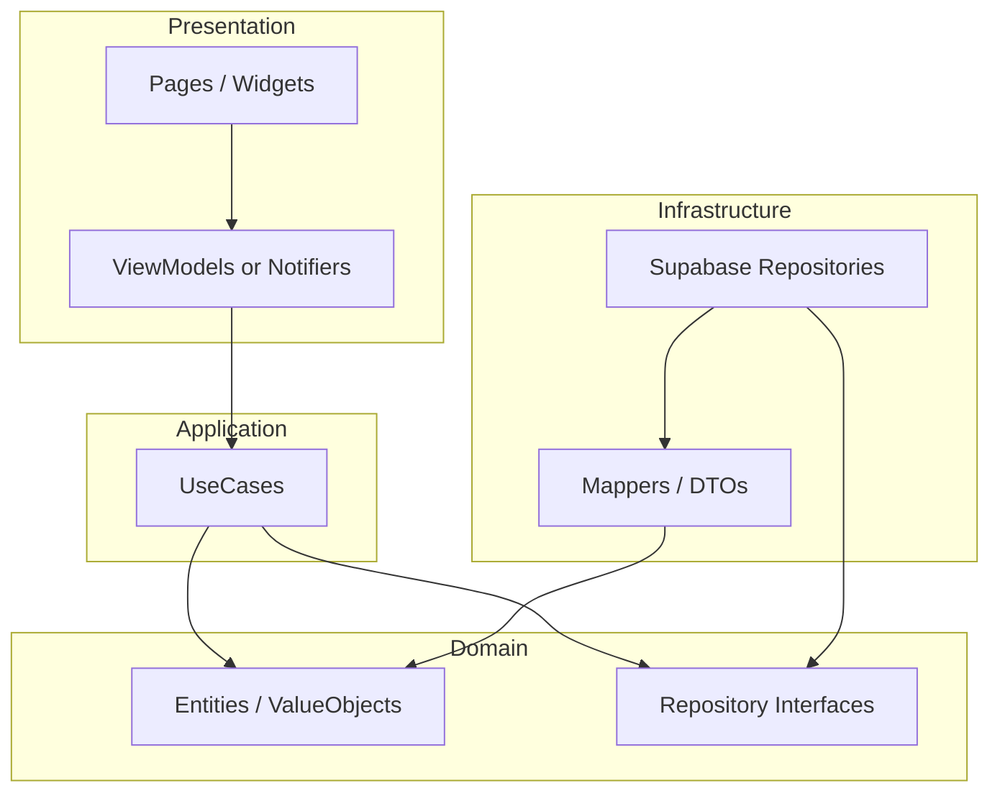
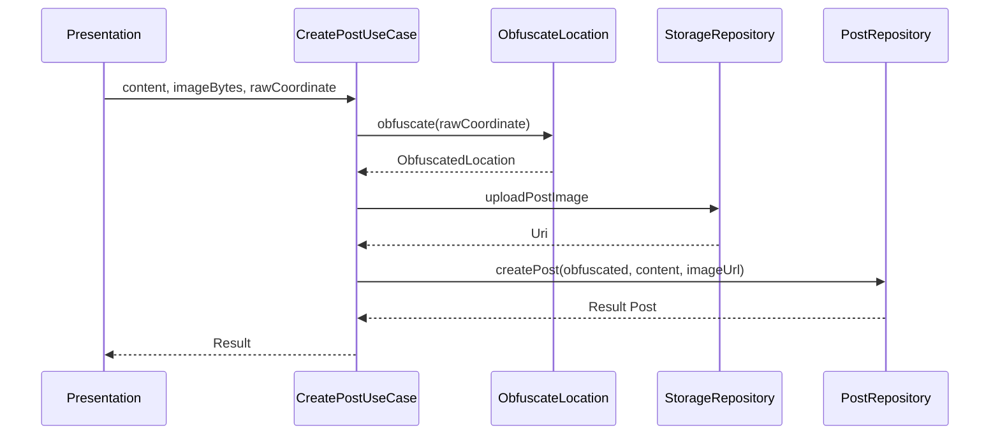

# ローカルSNS 全体設計書（Flutter / Supabase）

| 項目 | 内容 |
|------|------|
| 文書名 | ローカルSNS 全体設計書 |
| 対象 | Flutter クライアント + Supabase（PostgreSQL / PostGIS / Auth / Storage） |
| 版数 | 1.0 |
| 作成日 | 2026-04-01 |
| 関連文書 | [要件定義書](./requirements-local-sns-flutter-supabase.md) |

---

## 1. 設計の目的と範囲

### 1.1 目的

本書は要件定義書に記載されたローカルSNSを、**クリーンアーキテクチャ**の依存方向に沿って実装するための**全体構成・レイヤ責務・命名規則・型モデル**を定義する。  
Flutter 側のテスタビリティ・保守性と、Supabase（DB / RLS / RPC）との境界の明確化を主眼とする。

### 1.2 スコープ

- **含む**: アプリ内のレイヤ構造、ドメイン型、リポジトリ境界、主要ユースケース、DB/API との対応、命名・ファイル配置の方針。
- **含まない**: 完全 DDL、個別 RLS ポリシーの SQL 全文（要件・別紙で扱う）、UI デザインのピクセル指定。

### 1.3 前提アーキテクチャ（論理）

```
[Presentation] ──依存──▶ [Application] ──依存──▶ [Domain]
       │                       │
       │                       └── 抽象（interface）のみ参照
       │
       └── [Infrastructure] が Domain の抽象を実装（DI で注入）
```

依存の原則: **内側（Domain）に向かってのみ依存する**。Infrastructure は Framework（Flutter / Supabase SDK）に依存してよいが、Domain はそれらを知らない。

---

## 2. クリーンアーキテクチャのレイヤ定義

本プロジェクトでは `lib/` 配下を次の**機能横断のレイヤ**で整理する（feature-first と併用する場合は、各 feature 内で同じレイヤ名を繰り返す）。

| レイヤ | ディレクトリ例 | 責務 | 許可される依存 |
|--------|----------------|------|----------------|
| **Domain** | `lib/domain/...` | エンティティ・値オブジェクト・ドメイン例外・リポジトリ**抽象**（interface） | 標準ライブラリ、`package:equatable` 等の純粋なユーティリティのみ。Flutter / Supabase 不可。 |
| **Application** | `lib/application/...` | ユースケース（1操作＝1クラスまたは 1 メソッド群）、入力/出力 DTO、トランザクション境界の調整 | Domain のみ。 |
| **Infrastructure** | `lib/infrastructure/...` | Supabase・Storage・位置取得の**具象実装**、JSON ↔ ドメイン型のマッピング | Domain（interface 実装）、外部パッケージ（`supabase_flutter`、`geolocator` 等）。Application に直接依存しない（interface 経由で逆方向注入）。 |
| **Presentation** | `lib/presentation/...` | 画面・Widget、状態管理（`ChangeNotifier` / `Riverpod` / `Bloc` 等はプロジェクトで統一）、ルーティング | Application（ユースケース呼び出し）、必要最小限で Domain の**読み取り専用モデル**（UI 向け View Model があればここ）。 |

### 2.1 依存関係の図（概要）



### 2.2 境界でのデータの流れ

1. **Presentation** がユーザ操作を受け、**Application** のユースケースを呼ぶ。
2. ユースケースが **Domain** のリポジトリ抽象を呼ぶ。
3. **Infrastructure** の実装が Supabase（`from` / `rpc` / Storage）を実行し、結果を **Domain 型**にマップして返す。
4. 失敗は **型付きの失敗**（sealed class / Result 型）で表現し、Presentation でメッセージ化する。

---

## 3. 機能モジュール（Feature）の切り方

要件の機能単位に対応する**縦割りモジュール**を推奨する。各モジュール内に `domain` / `application` / `infrastructure` / `presentation` のサブフォルダを置くか、レイヤを上位に置き `domain/entities/post.dart` のように横割りにするかはチームで統一する。

| モジュール | 主なユースケース例 |
|-----------|-------------------|
| `auth` | サインイン、サインアウト、セッション復元 |
| `location` | 権限取得、生座標取得、**ぼかし後** `GeoPoint` の生成（正確座標は永続化しない） |
| `posts` | 投稿作成、自分の投稿一覧（必要なら）、画像アップロード連携 |
| `feed` | ローカルフィード取得（RPC）、ページング、並び替え |
| `reactions` | 付与・変更・削除（1ユーザー1投稿1種） |
| `comments` | 一覧取得、投稿、1階層返信 |
| `profile` | プロフィール参照・更新（ニックネーム等） |

**ルール**: モジュール間の依存は、**Domain の抽象**または **Application の公開ユースケース**経由に限定し、Presentation から他 feature の具象 Repository を直接 import しない。

---

## 4. 型設計（Domain を中心に）

### 4.1 原則

- **Domain** では DB の行構造をそのまま表現しない。ビジネス意味のある**エンティティ**と**値オブジェクト**に分ける。
- Supabase からの生 JSON / `Map<String, dynamic>` は **Infrastructure の DTO** に受け、検証後に Domain 型へマップする。
- **識別子**は `typedef` または単一フィールドの値オブジェクトで意味を固定する（例: `PostId`, `UserId`）。

### 4.2 値オブジェクト（例）

| 型名 | 意味 | 不変条件・備考 |
|------|------|----------------|
| `UserId` | 認証ユーザー ID | `String` の非空 UUID 形式（検証は Infrastructure または factory で） |
| `PostId` | 投稿 ID | 同上 |
| `GeoCoordinate` | WGS84 の緯度経度 | 緯度 [-90, 90]、経度 [-180, 180]。**サーバ送信可能なのはぼかし後のみ**というルールを型コメントとユースケースで明示 |
| `ObfuscatedLocation` | ぼかし済み位置 | `GeoCoordinate` をラップし、「この値のみ永続化してよい」ことを表すブランド型風の扱いを推奨 |
| `FeedRadiusMeters` | フィード半径 | 要件どおり **5000** 固定を `const` で表現。マジックナンバーを散らさない |
| `PostTtl` | 投稿 TTL | 24 時間を `Duration` または専用型で表現 |
| `ReactionType` | リアクション種別 | `enum`（`like`, `look`, `fire`）。DB の `text` と 1:1 マッピング |
| `CommentId` | コメント ID | UUID |
| `NonEmptyString` | 非空文字列 | 投稿本文などバリデーション用（任意で導入） |

### 4.3 エンティティ（例）

| エンティティ | 主なフィールド（論理） | 備考 |
|-------------|------------------------|------|
| `Profile` | `UserId id`, `String? displayName`, `DateTime createdAt` | `auth.users` と対応する `profiles` 行のドメイン表現 |
| `Post` | `PostId id`, `UserId authorId`, `String content`, `Uri? imageUrl`, `ObfuscatedLocation location`, `DateTime createdAt`, `DateTime expiresAt` | `expires_at > now()` はクエリ側。Domain では「期限切れか」を判定するメソッドを持てる |
| `FeedPost` | `Post` + `int reactionCount`（人気順用）など | 一覧用の読み取りモデル。集計は RPC/ビュー結果をマップ |
| `Reaction` | `UserId userId`, `PostId postId`, `ReactionType type`, `DateTime createdAt` | `UNIQUE(user_id, post_id)` と整合 |
| `Comment` | `CommentId id`, `PostId postId`, `UserId authorId`, `CommentId? parentId`, `String content`, `DateTime createdAt` | `parentId == null` がトップレベル。子は 1 階層までをユースケースで検証 |

### 4.4 失敗・結果の型

Dart 3 では **`sealed class`** でドメインエラーを閉じた集合として表現する。

```dart
// 例（配置: lib/domain/core/failure.dart 等）
sealed class Failure {
  const Failure();
}

final class NetworkFailure extends Failure {
  const NetworkFailure();
}

final class AuthFailure extends Failure {
  const AuthFailure();
}

final class ValidationFailure extends Failure {
  const ValidationFailure(this.message);
  final String message;
}

// ユースケースの戻り値例: Future<Result<List<FeedPost>, Failure>>
```

Presentation では `Failure` を**ユーザー向け文言**に変換するマッパのみを持ち、ビジネス分岐は Application までに留める。

### 4.5 Infrastructure DTO（例）

| DTO 名 | 用途 |
|--------|------|
| `PostRow` / `PostDto` | `fromJson` / `toJson`、Snake_case キーと Dart フィールドの対応 |
| `RpcFeedParams` | `get_local_feed` 等の RPC パラメータ型 |
| `RpcFeedItem` | RPC 戻りの 1 行（Post + 集計カラム） |

**ルール**: DTO は `infrastructure` にのみ置き、Domain に漏らさない。

---

## 5. リポジトリ（抽象）とユースケース

### 5.1 リポジトリ interface（Domain）

命名: `*Repository`。メソッド名は**ドメイン語彙**（`fetchLocalFeed`, `createPost`, `upsertReaction`）。

| Interface | メソッド例 |
|-----------|------------|
| `AuthRepository` | `Stream<SessionState> watchSession()`, `Future<void> signOut()` |
| `LocationRepository` | `Future<LocationPermissionState> requestPermission()`, `Future<GeoCoordinate> getCurrentPosition()`（生座標。ぼかしは別サービス） |
| `PostRepository` | `Future<Result<Post, Failure>> createPost({required ObfuscatedLocation location, ...})` |
| `FeedRepository` | `Future<Result<List<FeedPost>, Failure>> fetchFeed({required GeoCoordinate viewerQueryPoint, required FeedCursor? cursor, required FeedSort sort})` |
| `ReactionRepository` | `Future<Result<void, Failure>> upsertReaction(PostId postId, ReactionType type)` |
| `CommentRepository` | `Future<Result<List<Comment>, Failure>> listByPost(PostId postId)`, `Future<Result<Comment, Failure>> addComment(...)` |
| `ProfileRepository` | `Future<Result<Profile, Failure>> getCurrentProfile()` |
| `StorageRepository` | `Future<Result<Uri, Failure>> uploadPostImage(Uint8List bytes, String contentType)` |

**注意**: 閲覧者のクエリ用座標は要件どおり**クエリにのみ使用**し、サーバに正確座標を永続化しない方針と、`ObfuscatedLocation` / 生座標の使い分けで表現する。

### 5.2 ユースケース（Application）

命名: **動詞 + 対象**（`CreatePost`, `LoadLocalFeed`, `SubmitReaction`）。  
1 クラス 1 メソッド `call()` パターンまたは `execute()` で統一。

例:

- `CreatePostUseCase`: 画像アップロード → URL 取得 → `PostRepository.createPost`（`expires_at` は RPC 側で固定するならパラメータに含めない）。
- `LoadLocalFeedUseCase`: 位置権限・取得 → （必要ならクライアント側でクエリ用座標の扱いを決定）→ `FeedRepository.fetchFeed`。
- `ObfuscateLocationUseCase`（または Domain サービス）: 生 `GeoCoordinate` → `ObfuscatedLocation`（±300m〜1km のルールをここに集約）。

---

## 6. Supabase との対応

### 6.1 テーブル / RPC とリポジトリ

| リソース | クライアントからのアクセス | 実装クラス例 |
|----------|---------------------------|--------------|
| `profiles` | `from('profiles').select/upsert` | `SupabaseProfileRepository` |
| `posts` | INSERT は直接または `rpc/create_post` | `SupabasePostRepository` |
| ローカルフィード | **`rpc/get_local_feed`** 推奨（要件） | `SupabaseFeedRepository` |
| `reactions` | upsert / delete | `SupabaseReactionRepository` |
| `comments` | insert / select | `SupabaseCommentRepository` |
| Storage（投稿画像） | bucket  upload | `SupabaseStorageRepository` |

### 6.2 RLS とアプリ責務

- **認可の正**は DB（RLS）。クライアントはあくまで UX と入力検証。
- 地理条件・TTL は **RPC 内**で強制する設計を推奨し、アプリは二重にフィルタしてもよいが、**セキュリティ依存はしない**。

### 6.3 型マッピング（DB ↔ Dart）

| DB 型（概念） | Dart 側 |
|---------------|---------|
| `uuid` | `String`（`UserId` 等でラップ） |
| `timestamptz` | `DateTime`（UTC 扱いを統一） |
| `text` | `String` |
| `geography(Point,4326)` | RPC では `lat`/`lng` の `double` 受け渡し、Domain では `ObfuscatedLocation` |
| リアクション `type` | `ReactionType` enum（不明値は `Failure` またはマッピング失敗） |

---

## 7. 命名規則

### 7.1 Dart / Flutter（Effective Dart に準拠）

| 対象 | 規則 | 例 |
|------|------|-----|
| ファイル名 | `snake_case.dart` | `create_post_use_case.dart` |
| クラス / enum / typedef | `UpperCamelCase` | `CreatePostUseCase`, `ReactionType` |
| メソッド・変数 | `lowerCamelCase` | `fetchFeed`, `obfuscatedLocation` |
| 定数 | `lowerCamelCase`（Dart 慣習） | `defaultFeedRadiusMeters` |
| プライベート | 接頭辞 `_` | `_mapPostRow` |
| ブール | 形容詞・`is/has/can` | `isExpired`, `hasLocationPermission` |

### 7.2 レイヤ別の接尾辞・接頭辞

| 種別 | 命名例 |
|------|--------|
| ユースケース | `CreatePostUseCase`, `LoadLocalFeedUseCase` |
| Repository 抽象 | `PostRepository`（`IPostRepository` は Dart では非推奨） |
| Repository 実装 | `SupabasePostRepository` |
| DTO | `PostDto`, `RpcFeedItemDto` |
| Mapper | `PostMapper.fromDto`, `PostMapper.toRow` |
| Presentation の状態 | `FeedState`, `FeedNotifier` / `FeedCubit`（採用パターンに合わせる） |

### 7.3 PostgreSQL / Supabase（DB）

| 対象 | 規則 | 例 |
|------|------|-----|
| テーブル | `snake_case` 複数形 | `posts`, `profiles`, `reactions` |
| カラム | `snake_case` | `user_id`, `expires_at`, `parent_comment_id` |
| RPC | `snake_case` 動詞句 | `get_local_feed`, `create_post` |
| インデックス | `idx_<table>_<columns>` | `idx_posts_location` |

クライアントの Dart フィールドは **camelCase** とし、JSON マッピングで snake_case と対応させる。

---

## 8. 主要フロー（シーケンス）

### 8.1 投稿作成（ぼかし位置・画像あり）



### 8.2 ローカルフィード取得

```mermaid
sequenceDiagram
  participant UI as Presentation
  participant UC as LoadLocalFeedUseCase
  participant LR as LocationRepository
  participant FR as FeedRepository
  UI->>UC: load(cursor)
  UC->>LR: getCurrentPosition (or cached query point)
  LR-->>UC: GeoCoordinate (query only; not persisted as exact on server)
  UC->>FR: fetchFeed(point, cursor, sort)
  FR-->>UC: Result List FeedPost
  UC-->>UI: Result
```

---

## 9. テスト戦略（設計レベル）

| レイヤ | 方針 |
|--------|------|
| Domain | 純関数・不変条件のユニットテスト（期限切れ判定、ぼかし距離の範囲など） |
| Application | Repository を **モック**し、ユースケースの分岐をテスト |
| Infrastructure | 結合テスト（Supabase ローカル or ステージング）または `http` モック |
| Presentation | Widget テスト（主要画面の表示・ローディング・エラー） |

---

## 10. 改訂履歴

| 版 | 日付 | 変更内容 |
|----|------|----------|
| 1.0 | 2026-04-01 | 初版（要件定義書 1.0 に対応） |

---

## 11. 承認（任意）

| 役割 | 氏名 | 日付 |
|------|------|------|
| 作成 | | |
| レビュー | | |
